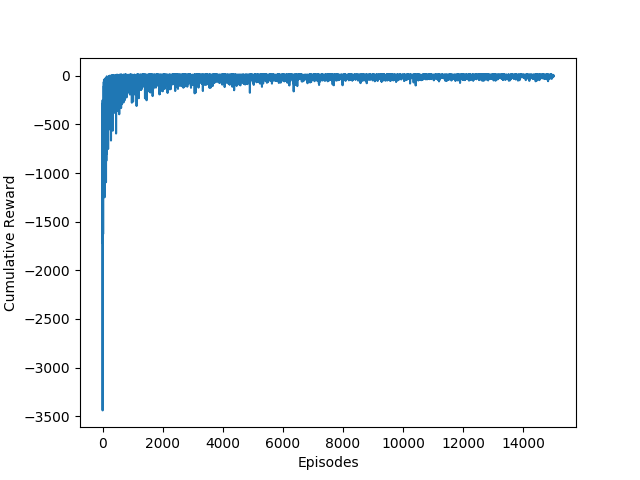

# Arler: Toy Explorer of Hierarchical Reinforcement Learning

> This repo is under active development. If you find any slip-ups or want to contribute, please [let me know](mailto:sasha@sdll.space).

## Installation

To install the development version:

```bash
git clone https://github.com/sdll/arler
cd arler
pip install -e .
```

## Contents

- [x] Introduction
- [x] Technical Background
  - Action Models
  - Task Hierarchies & Goal Predicates
  - Causal Analysis & Relevance Annotation
- [ ] Algorithm
  - Overview
  - Task Discovery
  - Specialisation & Termination
  - Abstraction
  - Generalisation
- [ ] Empirical Evaluation
- [ ] Conclusion

## Introduction

Learning through play is a simple and powerful form of making sense of the world. Whether animals or machines, learning agents source information and engage with the environment, both of which can inflict significant costs.

Resource scarcity calls for the organised search of effective policies that map situations to actions. Some domains offer obvious quantifiable metrics of successful interaction: scores in games, grades in schools, wages and profits in companies. _Reinforcement learning_ gives a range of methods to maximise the numerical reward.

In a classical setting, no prior knowledge is available to the learner, who must discover optimal policies on their own by trial and error, with immediate or delayed rewards.

The sheer range of options available for discovery is often overwhelming, which mandates the approach of _transfer learning_: breaking the problem down into essential components and training the agent in a simpler context, with a promise of cheaper exploration and exploitation of domains that share the same invariants.

Building a hierarchy of routines can extract essential information about the domain and speed up the process of learning. The primary focus of this project is to find optimal subroutines automatically.

Three assumptions are key:

1. Any sequence of actions that achieves the target goal has a well-defined reason that explains its success.
2. Hints of causality uncover an optimal task hierarchy.
3. Hierarchies are more transferrable across domains than flat sequences of actions.

The next section describes the technical toolkit used to develop the method. Then we describe the algorithm, benchmark its performance on the [taxi](https://gym.openai.com/envs/Taxi-v2) domain, conclude with the criticism of the general approach and lay out possible improvements.

## Technical Background

Markov decision processes (MDPs) give a framework for modelling sequential decision-making of the _agent_ that operates in the _environment_. Two sets and two maps completely determine the MDP:

- The set of _environment states_, which depend on _environment variables_
- The set of _agent actions_
- The _transition function_ that specifies how each action operates on every state
- The _reward function_ that gives numerical feedback to the agent

On receiving input from the environment in the form of a state id, the agent either stops or picks the next action, in which case the environment might change to a new state.

The agent _policy_ (or _strategy_) decides what action to take in each state. The _optimal strategy_ maximises the agent reward. In the case when the number of states and actions is finite, the chosen policy fixes the cumulative reward. This makes computing the _value_ of each state with respect to the policy feasible: dynamic programming is a classic approach. Alas, it suffers from the curse of dimensionality, and breaks down in most domains of interest.

One trick to resolve the issue is to divide and conquer: hierarchical reinforcement learning decomposes original MDPs into more manageable chunks, solves them one by one and combines intermediate results into a single policy.

### Action models

Relationships between environment variables are encoded using directed bipartite graphs.

Nodes on the left are environment variables before the action is executed. Nodes on the right, with one for the reward, are the variables after. Edges signify dependency.

### Task Hierarchies & Goal Predicates

Task hierarchies need a tractable and lightweight representation, and the MAXQ graph provides one of them (see [[4]](https://pdfs.semanticscholar.org/fdc7/c1e10d935e4b648a32938f13368906864ab3.pdf) for details).

In this framework, a directed acyclic graph captures task-subtask relationships. Primitive actions are the leaves, and composite tasks are internal nodes, each of which has the goal to achieve, expressed as the termination predicate, the conditions it needs to succeed, and the set of tracked environment variables.

### Causal Analysis & Relevance Annotation

Activity models, combined with a successful trajectory of states and tasks, serve as raw materials for constructing a hierarchy.

Environment variables are _relevant_ to some action if at least one of the following conditions holds:

- there is a non-zero chance that the variable changes its value after the action is completed
- the variable is important for getting the reward

To obtain a _relevantly annotated trajectory_ (RAT) from the original sequence, remove cycles and add an edge between any pair of actions that share a relevant variable (but no actions in between do), and set its direction in line with the chronological precedence.

The learning process consists of partitioninig a RAT and feeding it into MAXQ.

## Algorithm

### Overview

The algorithm of hierarchy induction via models and trajectories (HI-MAT) builds a hierarchy by inferring subroutines from the RAT, target goal and action models.

First, the algorithm parses the target goal. Processing each subgoal through the lens of action models, it derives preconditions and constructs RAT segments of smaller size, merges them conditionally and recurses deeper down. The algorithm terminates when the RAT is a single action or a collection of action blocks with identical termination conditions and children.

| Input          | Output         |
| -------------- | -------------- |
| action models  | hierarchy root |
| RAT            |
| goal predicate |

| HI-MAT                                                                                                                                                                                                                                                                                                  |
| ------------------------------------------------------------------------------------------------------------------------------------------------------------------------------------------------------------------------------------------------------------------------------------------------------- |
| **Base Case**                                                                                                                                                                                                                                                                                           |
| If the trajectory consists of a single action, then set this action as the only child of the root node. The only tracked environment variables are the variables relevant to this action.                                                                                                               |
| If, on the other hand, actions in the trajectory have identical relevance, then bundle them together under the root node, with the goal predicate as the termination condition, and set tracked variables to the union of relevant variables from action models and variables comprising the predicate. |
| **Recursive Step**                                                                                                                                                                                                                                                                                      |
| If neither of the conditions above holds, partition the RAT into segments by figuring out the largest subgraph achieving the target goal and including all the necessary and sufficient causal links.                                                                                                   |
| If some segment coincides with the entire trajectory, split it in two, separating the ultimate action from the rest.                                                                                                                                                                                    |
| If any two segments overlap, merge them into one, sticking together the target goals they achieve.                                                                                                                                                                                                      |
| Invoke the algorithm recursively on each segment, and add the result to the root node returned.                                                                                                                                                                                                         |
| Set the termination condition for the root node to the goal predicate.                                                                                                                                                                                                                                  |
| Make the composite model of the returned task by merging the subroutine models.                                                                                                                                                                                                                         |
| If any primitive action has the model isomorphic to the subgraph of the composite model, add it as a child.                                                                                                                                                                                             |
| Return the root node.                                                                                                                                                                                                                                                                                   |

### Task Discovery

The algorithm first parses the target predicate and determines the initial set of variables to consider: the _goal set_. Then it looks at each literal inside and follows adjacent edges from the RAT to find segment boundaries using a simple iterative rule.

If this segment is neither the state it has started with nor the entire trajectory, all the literals that enter the segment are added to the goal set.

If, however, it coincides with the entire trajectory, the algorithm splits the RAT in two: the first part contains parents of the ultimate action together with its preconditions (which determine the goal predicate of the segment), while the second contains only the ultimate action.

The algorithm then goes on scanning until it accounts for all of the variables relevant to the subgoal, generating structured batches of sequential actions that are then tied together under the root node.

### Specialisation & Termination

Recursive calls build layers of the MAXQ hierarchy, and the composite action at the root of each subtree. A subroutine is thus defined by the child tasks and the termination condition that the subtree achieves. This termination condition is just a conjunction of appropriate variables (relevant to the subtasks and present in the target goal that the segment achieves).

### Abstraction

Redundant environment variables slow down the process of learning, so the algorithm is designed to be thrifty.

First, to construct the composite action model of the subtask, the algorithm merges models of primitive actions that the segment contains.

Secondly, the algorithm constructs the set of variables relevant to the subroutine by taking the union of the relevant variables from the merged action models and the variables used in the termination predicate.

Finally, the algorithm accounts for the variables from the termination condition that have not been added yet. This, in effect, parametrises the task and linkss it to the context of the current state.

### Generalisation

Since the algorithm works with a single successful trajectory, the information about the environment it extracts is likely to be incomplete, so to maximise the quality of transfer it verifies that all the useful primitive actions have been incorporated in the resultant hierarchy.

The utility of a primitive action not in view is decided by checking whether its model is a subgraph of the composite model associated with primitive actions already in use. This heuristic is based on the assumption that unobserved primitives with familiar structures achieve the same goal as the primitive children of the task.

## Empirical Evaluation



## Conclusion

## References

1. Mehta, Neville. ["Hierarchical Structure Discovery and Transfer in Sequential Decision Problems"](https://ir.library.oregonstate.edu/downloads/6395wb334) (2011)

2. Mehta, Neville; Ray, Soumya; Tadepalli, Prasad; Dietterich, Thomas. ["Automatic discovery and transfer of task hierarchies in reinforcement learning"](https://pdfs.semanticscholar.org/cb3a/ef8917900cea4492899bd1f724bcb5e98b8f.pdf) (2011)

3. Sutton, Richard S.; Barto, Andrew G. ["Reinforcement Learning: An Introduction"](http://incompleteideas.net/book/bookdraft2017nov5.pdf) (2017)

4. Dietterich, Thomas G. ["The MAXQ Method for Hierarchical Reinforcement Learning"](https://pdfs.semanticscholar.org/fdc7/c1e10d935e4b648a32938f13368906864ab3.pdf) (2000)
